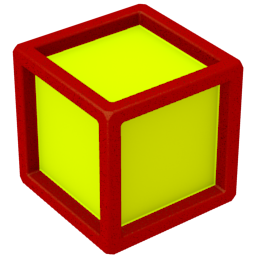

Blocks
======

**Blocks**, an Island Xtreme Stunts Minigame Level Editor, written in [Python 3](http://www.python.org)
by [Triangle717](http://Triangle717.WordPress.com).

Downloads
---------
 
* Format Details can be found at [`Format-Details.md`](Documentation/Format-Details.md)

* Version 0.8.2 - Released May 26, 2013 

> [Source Code](https://github.com/le717/Blocks/tree/0.8.2)

> [Direct Download](https://github.com/le717/Blocks/archive/0.8.2.zip)

* Version 0.5 - Released May 23, 2013 

> [Source Code](https://github.com/le717/Blocks/tree/0.5)

> [Direct Download](https://github.com/le717/Blocks/archive/0.5.zip)

Contributing
------------

If you would like to contribute to the development of **Blocks**, please be sure to read [`CONTRIBUTING.md`](Documentation/CONTRIBUTING.md)

Credit
------
***Blocks*, created 2013 Triangle717, and released under the [GNU General Public License Version 3](http://www.gnu.org/licenses/gpl-3.0-standalone.html).**